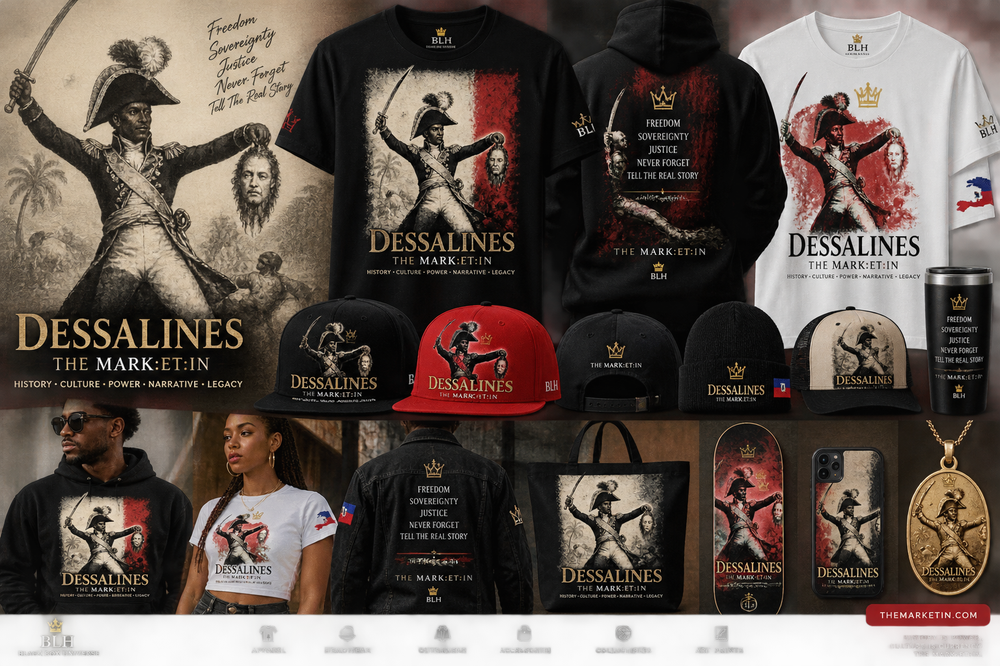

# barrington-legacy-holdings
An open, collaborative ecosystem for building legacy through media, music, technology, education, commerce, historical research, and social impact—turning recovered knowledge and creative ideas into documented, protectable, and future-facing projects.
Barrington Legacy Holdings

Recover. Verify. Create. Protect. Return. Teach. Repeat.

Barrington Legacy Holdings is a collaborative ecosystem for transforming knowledge, creativity, technology, history, and intellectual property into lasting capabilities that can benefit future generations.

This repository serves as the living documentation and collaboration hub for the ecosystem—including Black Box™, Creator Cube, Yahkey, YAHWEALTH™, Black Pearl Voyage, In-Tentions, music and media projects, Atlantis Restoration research, educational systems, technology, products, and future ventures.

The purpose is bigger than storing files.

We are building a system that other people can understand, contribute to, improve, build upon, and carry forward.

The core operating loop is:

RECOVER → VERIFY → ATTRIBUTE → EVALUATE → CREATE → PROTECT → RETURN → TEACH → REPEAT

Every project does not have to become the same thing. The infrastructure connects them while preserving their individual identities, contributors, histories, intellectual property, and missions.

Why this repository exists

Ideas should not have to remain trapped in one person's head.

GitHub gives the ecosystem a place where:

- Ideas become documented projects.
- Projects become organized workstreams.
- Research becomes traceable records.
- Contributions become visible.
- Decisions become documented.
- Creative work receives attribution.
- Experiments can be tested and improved.
- Collaborators can find where they can help.
- Versions and changes can be preserved.
- Future builders can understand what came before them.

The mission must be bigger than the founder.

The goal is to build something capable of continuing beyond any single person—while keeping the intention, attribution, evidence, creativity, and human impact at the center.
---

## New Merch: DESSALINES | THE MARK:ET:IN

A BLH Black Box™ Universe historical figure collection honoring Jean-Jacques Dessalines: apparel, headwear, outerwear, accessories, collectibles, and art prints.

History is power. Culture is currency. The MARK:ET:IN.

[View the collection](docs/01-black-box/merch/DESSALINES-THE-MARKETIN.md) · [All BLH merch](docs/01-black-box/merch/README.md)
